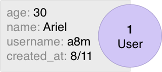

# Fields
## Quick Summary
스키마에서의 필드들은 노드의 속성을 나타냅니다. 예를 들어, User라는 스키마에 age, name, username 그리고 created_at가 있다고 가정해보겠습니다.<br/>
<br/>
코드는 다음과 같이 작성할 수 있습니다.
```go
package schema

import (
    "time"

    "entgo.io/ent"
    "entgo.io/ent/schema/field"
)

// User schema.
type User struct {
    ent.Schema
}

// Fields of the user.
func (User) Fields() []ent.Field {
    return []ent.Field{
        field.Int("age"),
        field.String("name"),
        field.String("username").
            Unique(),
        field.Time("created_at").
            Default(time.Now),
    }
}
```
필드들은 Fields메소드에 정의되어서 사용하게 됩니다. <br/>
required(not null)가 기본 설정이며 null을 허용하고 싶다면 Optional을 통해 사용할 수 있습니다.

## Types
필드에 사용할 수 있는 타입들은 다음과 같습니다.
- go에서 지원해주는 모든 숫자타입. Like int, uint8, float64, etc.
- bool
- string
- time.Time
- UUID
- []byte (SQL only).
- JSON (SQL only).
- Enum (SQL only).
- Other (SQL only).
다음과 같이 사용하실 수 있습니다.
```go
package schema

import (
    "time"
    "net/url"

    "github.com/google/uuid"
    "entgo.io/ent"
    "entgo.io/ent/schema/field"
)

// User schema.
type User struct {
    ent.Schema
}

// Fields of the user.
func (User) Fields() []ent.Field {
    return []ent.Field{
        field.Int("age").
            Positive(),
        field.Float("rank").
            Optional(),
        field.Bool("active").
            Default(false),
        field.String("name").
            Unique(),
        field.Time("created_at").
            Default(time.Now),
        field.JSON("url", &url.URL{}).
            Optional(),
        field.JSON("strings", []string{}).
            Optional(),
        field.Enum("state").
            Values("on", "off").
            Optional(),
        field.UUID("uuid", uuid.UUID{}).
            Default(uuid.New),
    }
}
```

## ID Field
id필드에 경우 선언이 필수적이지 않습니다. 생성 시, 자동으로 int타입으로 생성해줍니다. 만약 설정을 바꿔야한다면 codegen-option을 통해 바꿀 수 있습니다.<br/>
모든 테이블을 통틀어 ID를 다 고유하게 가져가야 한다면 스키마 마이그레이션 작업을 할떄 WithGlobalUniqueID을 사용하시길 바랍니다.<br/>
id필드에 타입을 바꾸길 원하신다면 id를 필드에 추가하신 다음 원하시는 타입으로 설정해주시면 됩니다.
예시)
```go
// Fields of the Group.
func (Group) Fields() []ent.Field {
    return []ent.Field{
        field.Int("id").
            StructTag(`json:"oid,omitempty"`),
    }
}

// Fields of the Blob.
func (Blob) Fields() []ent.Field {
    return []ent.Field{
        field.UUID("id", uuid.UUID{}).
            Default(uuid.New).
            StorageKey("oid"),
    }
}

// Fields of the Pet.
func (Pet) Fields() []ent.Field {
    return []ent.Field{
        field.String("id").
            MaxLen(25).
            NotEmpty().
            Unique().
            Immutable(),
    }
}
```
만약 id를 커스텀 해서 쓰고 싶다면 DefaultFunc를 사용하여 구현하시면 됩니다.
```go
// Fields of the User.
func (User) Fields() []ent.Field {
    return []ent.Field{
        field.Int64("id").
            DefaultFunc(func() int64 {
                // An example of a dumb ID generator - use a production-ready alternative instead.
                return time.Now().Unix() << 8 | atomic.AddInt64(&counter, 1) % 256
            }),
    }
}
```
## DatabaseType
